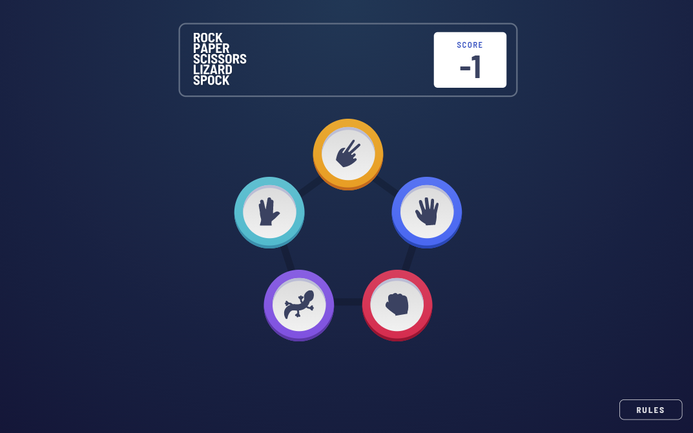

# Frontend Mentor - Rock, Paper, Scissors, Lizard, Spock

This is a solution to the [Rock, Paper, Scissors challenge on Frontend Mentor](https://www.frontendmentor.io/challenges/rock-paper-scissors-game-pTgwgvgH). Frontend Mentor challenges help you improve your coding skills by building realistic projects.

I had a lot of fun with this challenge! Most of the time I spent on the intricacies of the design, the JavaScript part was really straight forward in the end.

### Features

- I built the bonus version of the challenge, which includes the moves of "Lizard" and "Spock".
- The game is as simple as it gets. You choose a move, then the computer chooses a move at random. You can win, lose or tie. Each round your score gets updated.
- If you want to know what beats what in this version of the game, there is a button to open a popup with the rules.

### Built with

- SCSS
- Grid and Flexbox Layouts
- Desktop first, fully responsive
- Vanilla JavaScript

### Considerations

Most of my trouble came from resizing and positioning the icons for responsivity and the different game states, and I could have probably made the code a lot prettier with more Sass mixins or extends to have all the dimensions of the "coins" simply be ratios of a single size number.
Were I building such a project from scratch, I would probably opt to design the full icons as SVG files and save myself the 150 lines of code for coloring and resizing the individual components.
The biggest pain was in fact the styling for the "winning" move, a pseudo-element with a background gradient. On smaller screens the element was always either not overflowing the page and thus pushing the whole layout to one side, or when I set overflow to hidden on the main element, the top and bottom were cut off. I ended up with the hacky solution of giving the main element an equal amount of padding and negative margin, which fixed the problem except for extending the page to the bottom on smaller screens, creating a scrollbar. Could not be bothered to go into it even further.
The JavaScript contained nothing new, just a modal window, a bunch of showing and hiding elements and conditionals, for which I decided to use object literals instead of if or switch statements, which for 25 cases really is a lot cleaner.

Cheers!
